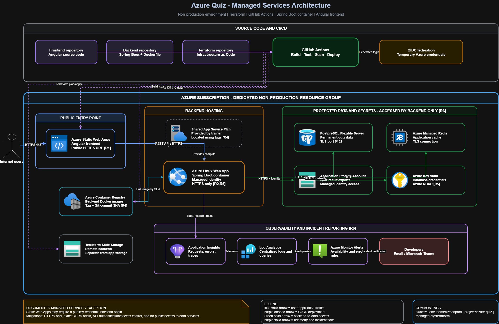

# Azure Quiz - Infrastructure

Infrastructure as Code for the non-production deployment of the Azure Quiz
application on Microsoft Azure.

The application consists of:

- an Angular frontend;
- a Java Spring Boot backend;
- PostgreSQL for persistent data;
- Azure Managed Redis for caching;
- Azure Storage for generated files;
- Azure Key Vault for secrets.

## Project status

The managed-services infrastructure is deployed in the non-production Azure
environment and the final Terraform plan reports no drift. Backend application
delivery is prepared through GitHub Actions and Azure workload identity
federation.

## Architecture

The selected target is **Azure managed services**:

- Azure Static Web Apps hosts the Angular frontend;
- Azure Linux Web App runs the Spring Boot container;
- the Web App uses the shared App Service Plan provided by the trainer;
- Azure Container Registry stores immutable backend images;
- PostgreSQL Flexible Server stores application data;
- Azure Managed Redis provides caching;
- Azure Storage stores exported quiz results;
- Azure Key Vault stores sensitive configuration;
- monitoring and alerting are intentionally deferred to a later iteration.



The editable draw.io source is available here:

- [Managed-services architecture](docs/architecture-managed-services.drawio)

### Main application flow

```text
Internet users
      |
      | HTTPS
      v
Azure Static Web Apps
      |
      | HTTPS REST API
      v
Azure Linux Web App
      |
      +--> PostgreSQL Flexible Server
      +--> Azure Managed Redis
      +--> Storage Account
      +--> Azure Key Vault
```

## Why managed services?

Managed services were selected instead of AKS to reduce operational complexity
and complete the project within the available implementation period.

This approach still demonstrates:

- deployment of a Spring Boot container;
- automated application delivery;
- reproducible infrastructure with Terraform;
- separation between frontend, backend and data services.

Centralized monitoring, traces and alerts are intentionally deferred to a
later iteration.

The trade-off is that Static Web Apps may require the backend to expose a public
HTTPS origin. This exception will be documented and mitigated with:

- HTTPS only;
- CORS restricted to the exact frontend origin;
- authentication or API access control;
- managed identity for access to Azure services;
- public access disabled on data services whenever the subscription permissions
  and selected SKUs allow it.

## Architecture decisions

The important technical decisions and rejected alternatives are documented as
Architecture Decision Records:

- [ADR-0001: Use Azure managed services](docs/adr/0001-managed-services.md)
- [ADR-0002: Network security model](docs/adr/0002-network-security.md)
- [ADR-0003: Secrets and workload identities](docs/adr/0003-secrets-and-identities.md)
- [ADR-0004: Store Terraform state in Azure Storage (superseded)](docs/adr/0004-terraform-remote-state.md)
- [ADR-0005: Store Terraform state in HCP Terraform](docs/adr/0005-hcp-terraform-state.md)

## Azure environment

The subscription, assigned resource group, permissions and trainer-provided
App Service Plan were inspected before Terraform implementation:

- [Azure environment discovery](docs/azure-environment.md)

Confirmed deployment context:

- environment: non-production;
- resource group: `hmezouarRG`;
- region: `francecentral`;
- shared Linux App Service Plan: `plan-npr-prf2026` (`B3`) in
  `rg-shared-prf2026`;
- the shared plan is referenced but is not managed by this project.
- remote state and state locking: HCP Terraform (`app.terraform.io`);
- HCP Terraform organization: `hmezouar-azure-quiz`;
- HCP Terraform workspace: `azure-quiz-nonprod`;
- workspace execution mode: local.

The HCP Terraform organization and workspace have been created. Local HCP
authentication is configured with `terraform login app.terraform.io`. Its token
is stored outside this repository. Azure subscription and tenant identifiers
are supplied by the active Azure CLI session or CI/CD configuration and are
intentionally not published in this repository.

The HCP Terraform workspace uses local execution mode: HCP Terraform stores and
locks state, while GitHub Actions runs `terraform plan` and `terraform apply`
and authenticates to Azure through OIDC.

## Secrets management

Application secrets are stored in Azure Key Vault. The backend Web App uses a
system-assigned managed identity and receives the `Key Vault Secrets User` role
on the vault. GitHub Actions uses OpenID Connect instead of a permanent Azure
client secret.

Identifiers required by CI/CD are configured outside the source code:

- `AZURE_CLIENT_ID`;
- `AZURE_TENANT_ID`;
- `AZURE_SUBSCRIPTION_ID`.

## Planned repository structure

```text
.
├── .github/
│   └── workflows/
├── docs/
│   ├── architecture-managed-services.drawio
│   ├── architecture-managed-services.png
│   └── adr/
└── terraform/
    ├── environments/
    │   └── nonprod/
    └── modules/
        ├── container-registry/
        ├── key-vault/
        ├── network/
        ├── postgresql/
        ├── redis/
        ├── static-web-app/
        ├── storage/
        └── web-app/
```

The `terraform/environments/nonprod` root is now connected to HCP Terraform.
The reusable network module prepares:

- virtual network `10.50.0.0/16`;
- App Service integration subnet `10.50.1.0/24`;
- Private Endpoint subnet `10.50.2.0/24`;
- an NSG restricting integration-subnet egress;
- private DNS zones and VNet links for PostgreSQL, Managed Redis, Blob Storage
  and Key Vault.

The reusable Container Registry module prepares the private image repository
`acrhmezouarquiznonprod` on the cost-optimized Basic tier. Its administrator
account and anonymous image pulls are disabled. The Web App identity receives
`AcrPull`; the dedicated GitHub Actions identity receives `AcrPush` through
OIDC.

The reusable Web App module prepares the containerized Spring Boot backend on
the trainer-managed Linux B3 plan. It configures port `8080`, the `prod`
profile, `/actuator/health`, HTTPS-only access, Always On, VNet integration and
a system-assigned managed identity. That identity receives only `AcrPull` on
the project registry; no registry password is created. Database, cache,
storage and Key Vault settings are now supplied by their dedicated modules.
Backend API-key and exact frontend CORS settings remain deployment-stage
configuration rather than committed placeholders.

The reusable Key Vault module prepares `kv-hmezouar-quiz-np` on the Standard
tier with Azure RBAC, public network access disabled, a Private Endpoint and
the existing private DNS zone. The Web App identity receives only `Key Vault
Secrets User` on this vault. No secret is created in this iteration; future
secret provisioning must run through a network path that can reach the Private
Endpoint rather than temporarily exposing the vault publicly.

The PostgreSQL and Azure Managed Redis modules provide the backend data layer.
PostgreSQL 16 uses the burstable `B_Standard_B1ms` SKU, a private endpoint,
TLS, 32 GiB auto-growing storage and the `quizz` database. Azure Managed Redis
uses the cost-optimized `Balanced_B0` SKU, encrypted port 10000, `AllKeysLRU`
eviction and a private endpoint. Public access is disabled on both services.

The PostgreSQL password is generated as an ephemeral Terraform value and sent
only to write-only server and AzAPI arguments. The Redis access key is handled
as a sensitive provider value and copied to Key Vault through an AzAPI
`sensitive_body`. Both secrets are deployed as Azure Resource Manager child
resources, so the Key Vault can remain private without requiring a
VNet-reachable Terraform runner. The Web App receives service endpoints and
Key Vault references, never clear-text credentials.

The Storage module creates the private `sthmezouarquiznp` StorageV2 account,
the `application-files` Blob container and its Blob Private Endpoint. Public
and shared-key access are disabled. The backend uses its managed identity with
the account-scoped `Storage Blob Data Contributor` role, so no connection
string or storage key is needed.

The Static Web App module creates the Free `swa-hmezouar-quiz-np` frontend in
`westeurope`, the closest supported region to the application resources in
`francecentral`. Terraform exports only its public hostname and never its
deployment token. Building and uploading Angular remain CI/CD responsibilities.

The `github-actions-identity` module creates a user-assigned identity, an exact
federated credential for
`repo:hajarmezouar/bilan-azure-backend:environment:nonprod`, and two
resource-scoped roles: `AcrPush` on the application registry and
`Website Contributor` on the backend Web App. It creates no client secret.

Terraform owns the Web App infrastructure and bootstrap image configuration.
The backend pipeline owns the deployed immutable image tag, which is therefore
excluded from Terraform drift reconciliation while all other Web App settings
remain managed.

## Common tags

Every applicable resource created by this project will use consistent tags:

| Tag | Purpose |
| --- | --- |
| `owner` | Identifies the student who owns the resource |
| `environment` | Identifies the non-production environment |
| `project` | Groups resources belonging to Azure Quiz |
| `component` | Identifies the resource's application role |
| `managed-by` | Indicates that Terraform manages the resource |

The CI/CD workflows must discover shared resources using tags rather than
hard-coded resource names.

## Security principles

- No Azure or database credential is committed to Git.
- GitHub Actions authenticates to Azure using OpenID Connect.
- The backend uses a managed identity.
- Sensitive configuration is stored in Azure Key Vault.
- The frontend never connects directly to PostgreSQL, Redis, Storage or Key
  Vault.
- Terraform state and locking are managed by HCP Terraform.
- HTTPS is required for public and service-to-service communication.

## CI/CD objectives

The Terraform workflow will perform:

1. `terraform fmt -check`;
2. `terraform init`;
3. `terraform validate`;
4. IaC and secret scanning;
5. `terraform plan` on pull requests;
6. approved `terraform apply` for the non-production environment.

The application workflows will:

1. build and test the source code;
2. scan dependencies, secrets and container images;
3. build immutable artifacts;
4. deploy to the non-production environment;
5. run health checks and smoke tests;
6. notify developers when a deployment or application check fails.

## Prerequisites

Before implementing or deploying the infrastructure, confirm:

- access to the Simplon Azure subscription;
- the assigned resource group;
- the permitted Azure region;
- the required `owner` tag;
- the tags identifying the shared App Service Plan;
- the permitted PostgreSQL and Azure Managed Redis SKUs;
- permission to create Azure Container Registry;
- availability of private networking features;
- the identity and permissions used by GitHub Actions.

## Local tools

The project requires:

- Terraform;
- Azure CLI;
- Git;
- Docker for testing the backend container;
- an Azure account with access to the assigned resources.

## Local validation

The supplied Spring Boot backend and Angular frontend were launched together
successfully before the infrastructure implementation. PostgreSQL, Redis and
Azurite were provided locally through Docker Compose.

The validation evidence and commands are recorded in:

- [Local application validation](docs/local-validation.md)

## Signed commits

Project commits must be cryptographically signed. Git is configured to sign
commits with the contributor's registered SSH signing key:

```text
git config --global gpg.format ssh
git config --global user.signingkey ~/.ssh/id_ed25519.pub
git config --global commit.gpgsign true
```

Create commits with:

```text
git commit -S -m "<type>: <description>"
```

After pushing, GitHub must display the commit as `Verified`.

## Deployment

Authenticate locally before the first initialization:

```text
az login
terraform login app.terraform.io
```

The infrastructure workflow is:

```text
make terraform-check
make terraform-plan
make terraform-apply
```

From WSL, when PowerShell 7 is exposed as `powershell.exe`:

```text
make POWERSHELL=powershell.exe terraform-check
make POWERSHELL=powershell.exe terraform-plan
```

The script reads the subscription ID from the active Azure CLI session. After
applying the GitHub identity module, display the backend repository identifiers
with:

```text
terraform -chdir=terraform/environments/nonprod output -json backend_github_actions
```

Copy those identifiers to the protected GitHub environment `nonprod`. Never
commit HCP Terraform credentials, Azure tokens, publish profiles or registry
passwords.

## Related repositories

The project is intentionally divided into three repositories:

- `bilan-azure-terraform` - Azure infrastructure;
- `bilan-azure-backend` - Spring Boot API;
- `bilan-azure-frontend` - Angular frontend.

## Repository governance and security

- commits are signed with SSH and must display the GitHub `Verified` badge;
- root `CODEOWNERS` documents ownership of infrastructure, scripts and
  documentation;
- Dependabot checks Terraform providers and GitHub Actions every week;
- the `Security` workflow runs on every push and pull request;
- Trivy scans Terraform for high and critical IaC misconfigurations;
- Gitleaks scans the complete Git history for committed secrets.

The workflow does not rely on GitHub native secret scanning because its
availability can depend on repository visibility and the GitHub plan. Gitleaks
provides the required platform-independent control instead.
